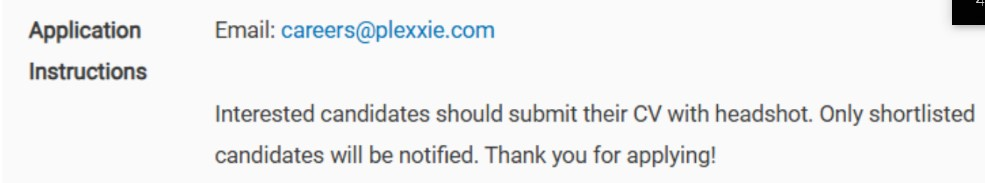
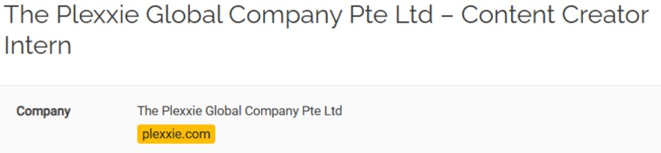
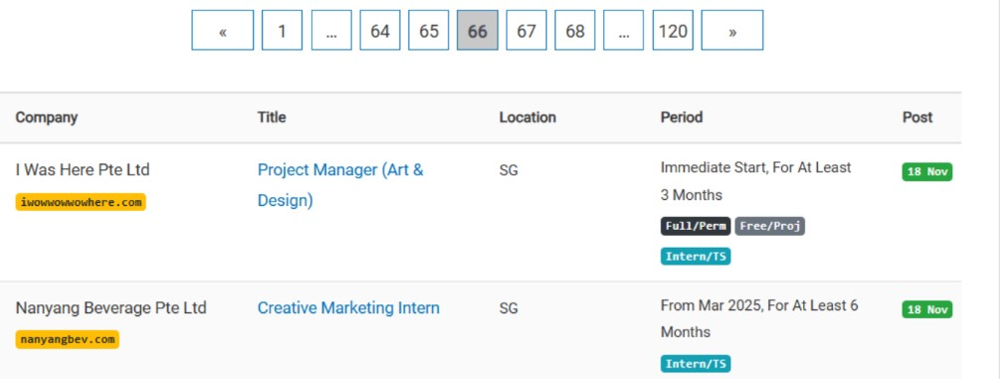
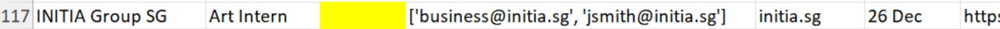
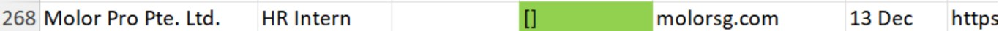
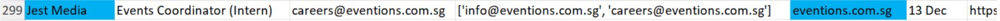

# **InternSG Scraper**

This manual guides users through how to use `internsg.com_search.ipynb` to generate an InternSG job list.

### 1. Set up all essential tools

Before running the code, complete the steps below to set up everything that is needed.

*Google Chrome* → The scraper drives Chrome to read pages that need JavaScript and to search Google. Make sure Chrome is installed and up to date.

*Python 3.9 or newer* → [Download Python](https://www.python.org/downloads/) if it is not installed yet.

*Visual Studio Code (VS Code)* → This is the platform that we will use to run the code.

1. [Download Visual Studio Code](https://code.visualstudio.com/download) and open it.
2. Inside the software, install the **Python** and **Jupyter** extensions in the Extensions view.
3. Open the InternSG Job List folder and rename it to InternSG_Job_List (avoid spaces in the folder name).
4. Open a terminal in VS Code and create a virtual environment:

   ```
   python -m venv venv
   ```

   Then activate it.

   - Windows: `.\venv\Scripts\activate`
   - Mac / Linux: `source venv/bin/activate`

5. Install every package the code needs (this reads the file `requirements.txt`):

   ```
   pip install -r requirements.txt
   ```

6. Open `internsg.com_search.ipynb`, click “Select Kernel” and “Python Environments”, and choose the kernel called “venv”.

   (The first code cell of the notebook runs the same `pip install -r requirements.txt` command, so you can also just run that cell.)

*Chrome driver*

Selenium controls Chrome through the “Chrome driver”. With the Selenium version in `requirements.txt` you do **not** need to download it: Selenium downloads the matching driver automatically the first time Chrome is started.

Only if that fails (for example, no internet access for the download, or a company firewall), set it up by hand:

- Download [Chrome Driver](https://googlechromelabs.github.io/chrome-for-testing/#stable) for your operating system, and unzip it.
- In the **Settings** cell, set `CHROMEDRIVER_PATH` to the full path of `chromedriver.exe` (for example `r"C:\chromedriver-win64\chromedriver.exe"`).

If Chrome cannot be started at all, the scraper still runs. It then skips the steps that need a browser (pages that hide their e-mail with JavaScript, and the Google search), and prints a message saying so.

### 2. Gain a basic understanding of the code

The notebook is split into cells that are run from top to bottom:

1. **Install the packages** – `pip install -r requirements.txt`.
2. **Imports**.
3. **Settings** – the only cell you normally need to edit (see section 3).
4. **Functions** – these only define the functions; they do not scrape anything yet.
5. **Run** – starts the scraper.
6. **Optional** – deletes the records that have no e-mail.

The main functions are:

- **create_chrome_driver(headless=True)**

  This function sets up Chrome and returns a Chrome Driver in headless mode. This mode enables the fetching process to be faster. The `BrowserSession` class keeps **one** Chrome window open for the whole run (instead of starting Chrome for every page) and restarts it if it crashes.

- **get_open_internships(page_num)**

  Reads one listing page and returns the posts that are still open and whose title contains the word “intern” (“Intern”, “Internship”, “Interns”; titles such as “International Sales Executive” are **not** counted).

- **extract_contact_info(detail_soup)**

  

  This function reads the Application Instructions section of the job description page. If an email address is found in this section, the code stores the email (careers@plexxie.com). This also works when the page hides the address from robots (the address is decoded by the code). If there are any links in this section, they are stored for later use.

- **extract_company_name(detail_soup)**

  

  This function extracts the company name (The Plexxie Global Company Pte Ltd) and its email domain (plexxie.com) from the Company section. If the job page does not show them, the company name and domain from the listing page are used instead.

- **search_company_website(domain, contact_links)** and **search_for_email(browser, company_name, domain)**

  

  If the job description page does not contain any email address in the Application Instructions section, the code looks for one online:

  1. **The company’s own website** (quick, no browser needed): the home page, its “Contact”, “Careers” or “About” pages, and the links that were given in the Application Instructions.
  2. **Google** – only if step 1 finds nothing. The code types keywords, including the company name and its domain, for example “IGG Singapore Pte Ltd igg.com contact email”. Then:
     - Every email shown in the search results is extracted, such as “cooperation@igg.com”.
     - The code selects result links that contain words such as “Contact”, “About” or “Privacy” in the title (or address), and visits the most promising ones (the company’s own website first). If no relevant links are found, it uses the first three result links.

  In both steps, only emails that belong to the correct domain (such as “@igg.com”) are stored. If Google shows a “robot check”, the code prints a message and skips Google for the rest of the run.

  A company that has several posts is only searched once.

- **choose_best_email(email_addresses_list)**

  Now that we have a list of found emails, this function helps select the most appropriate one. There are three situations:

  1. If the list contains only one found email, this email is selected as the best email.

  2. A list of about 20 job-related keywords is defined in `EMAIL_KEYWORDS`, ranging from most relevant to least relevant, such as “careers”, “recruit”, “jobs” and “hr”. If the list has multiple found emails, the code chooses the most relevant one. For example, “jobs.sg@igg.com” would be chosen due to the keyword “jobs”. Short keywords must be a whole word (so “chris.tan@…” is not mistaken for “hr”). If several emails match, the shortest one is chosen (“support@…” rather than “support.mumbai@…”).

  3. If no email matches any of the keywords, you may need to manually select the most appropriate email from the list of found emails.

- **save_to_excel(data, filename=None)**

  

  This function saves every extracted record into an Excel file. The file includes the above seven columns, which are populated with the extracted data. If the Excel file does not exist on your computer, the code creates a new one. Otherwise, it appends the new records to the last row of the existing file. If the file is open in Excel, the code waits for you to close it; if that does not work, the record is kept in a `… (unsaved records).csv` file next to it, so nothing is lost.

- **process_batch(start_page, end_page)**

  This is the most important function. It uses the functions above to carry out the entire fetching process. The following outlines the two main scraping steps, which loop until all posts on a specific page are handled. It stops early when it reaches a page that does not exist.

  

  **step 1:** Visit a specific page (e.g., page 66).
  - For each post, check if it is still open for applications.
  - If it is open, check if the position title contains the word “intern” (e.g., “Creative Marketing Intern”).
  - If the title contains “intern”, obtain the post date (for instance, 18 Nov).

  **step 2:** If the post fulfils all the requirements in step 1, visit the job description page.

  On the job description page:

  - Obtain the company name and its domain using `extract_company_name(detail_soup)`.
  - Check if there is any email provided by the company under the Application Instructions section using `extract_contact_info(detail_soup)`.
  - If an email is found, it is stored. If no email is available, search for email addresses online using `search_company_website(...)` and `search_for_email(...)`.
  - If emails are found online, select the most relevant email using `choose_best_email(email_addresses_list)`.
  - Finally, save the record into the Excel file using `save_to_excel(data)`.

### 3. Run the code

1. In the **Settings** cell, set the pages to scrape and run the cell:

   ```
   START_PAGE = 1   # first listing page (page 1 = the newest posts)
   END_PAGE = 2     # last listing page
   ```

   The output file is named after today’s date by default (for example `Joblist updated to 2026.9.30.xlsx`). Change `OUTPUT_FILE` if you want another name.

2. Run the **Functions** cells, then click “Execute Cell” on the **Run** cell. The notebook shows the records of this run in a table at the end.

Every record is saved to Excel as soon as it is ready, so nothing is lost if you stop the run. **Running it again is safe**: posts that are already in the Excel file are skipped, and posts that failed the last time are tried again. To start from scratch, delete or rename the Excel file.

The time needed depends on how many posts have to be searched online (usually a few minutes per page). If your network is fast and your computer has sufficient RAM and CPU power, you may lower `PAGE_LOAD_WAIT` in the Settings cell (the seconds to wait after a page opens in Chrome, default 4), for example to 1. Set `HEADLESS = False` if you want to watch the browser work, or `USE_GOOGLE_SEARCH = False` to skip Google completely.

### 4. Understand limitations of the code and possible solutions

There are three notable limitations in the code:

1. It is possible that sometimes, even if the code can find email addresses online, it fails to choose the most relevant one as the best email (the yellow cell) because no email matches the predefined keywords.

   

2. There is a chance that no relevant email (the green cell) is found. This can be because the corresponding company does not disclose its emails on the Internet or does not have an official website or social media accounts.

   

3. In some rare cases, the domain provided on the job description page does not belong to the company (the blue cells), which can lead to incorrect email scraping.

   

If we encounter these situations, it may be necessary to choose, search for, or double-check the emails ourselves. (The coloured cells in the screenshots are marked by hand.) If you do not want to work manually on this, you may choose to simply delete all the records that contain nothing in the E-mail column with the last code cell of the notebook: set `DELETE_ROWS_WITHOUT_EMAIL = True` and run it. While this method can save you time, it may result in the loss of part of the records in the job list. Nothing is deleted unless you change that setting, so “Run All” is safe.

A few more things to know:

- Google sometimes shows a “robot check” when it is used by a program. The code then skips Google for the rest of the run; the company website is still searched. Wait a while and run again later if you need the Google results.
- The scraper reads the public InternSG pages the way they are built today. If InternSG changes its page layout, the code may need to be adjusted.

*made 16 Jan 2025, updated 30 Sep 2026*
